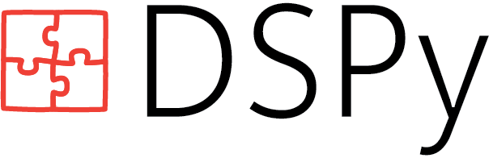

# dspy-local

**Local CLI runtime adapters for [DSPy](https://dspy.ai/)** — run DSPy programs through Codex, Qwen, and Claude command-line tools without an API key or cloud endpoint.

`dspy-local` extends DSPy with three `BaseLM` backends that invoke locally-installed CLI runtimes:

| Backend | CLI | Transports | GEPA |
|---|---|---|---|
| `dspy.CodexLM` | `codex exec` / `codex mcp-server` | CLI, MCP, auto-fallback | Yes |
| `dspy.QwenLM` | `qwen` | CLI | Yes |
| `dspy.ClaudeLM` | `claude -p --output-format json` | CLI | Yes |

All three work as drop-in replacements anywhere DSPy expects an LM — `dspy.Predict`, `dspy.ChainOfThought`, `dspy.Evaluate`, and DSPy optimizers including **[GEPA](https://arxiv.org/abs/2507.19457)**.

## Quickstart

```bash
git clone https://github.com/Hmbown/dspy-local.git
cd dspy-local
uv sync --extra mcp --extra dev
```

Verify the backend(s) you have installed:

```bash
# Codex
uv run python scripts/dspy_local_codex_doctor.py --json
uv run python scripts/dspy_local_codex_smoke.py --transport auto --json

# Claude
uv run python scripts/dspy_claude_doctor.py --json
uv run python scripts/dspy_claude_smoke.py --json

# Qwen
uv run python scripts/dspy_qwen_doctor.py --json
uv run python scripts/dspy_qwen_smoke.py --json
```

## Prerequisites

Install and authenticate whichever CLI(s) you want to use:

- **Codex**: `codex --help` works and `~/.codex/auth.json` exists or `OPENAI_API_KEY` is set.
- **Qwen**: `qwen --help` works and `~/.qwen` credentials are configured.
- **Claude**: `claude --help` works and `~/.claude/credentials.json` exists or `ANTHROPIC_API_KEY` is set.

## Usage

```python
from pathlib import Path
import dspy

# Pick your backend
lm = dspy.CodexLM(model="codex/default", repo_root=Path.cwd())
# lm = dspy.QwenLM(model="qwen/default", repo_root=Path.cwd())
# lm = dspy.ClaudeLM(model="claude/sonnet", repo_root=Path.cwd())

dspy.configure(lm=lm)

class QA(dspy.Signature):
    question = dspy.InputField()
    answer = dspy.OutputField()

predict = dspy.Predict(QA)
result = predict(question="What is the capital of France?")
print(result.answer)
```

## Model Aliases

**Codex:**

| Alias | Behavior |
|---|---|
| `codex/default` | Prefer MCP, fall back to CLI |
| `codex-exec/default` | Force `codex exec` |
| `codex-mcp/default` | Force `codex mcp-server` |

Override with `DSPY_CODEX_TRANSPORT=auto|cli|mcp`.

**Claude:** `claude/default`, `claude/sonnet`, `claude/opus`, `claude/claude-sonnet-4-6`

**Qwen:** `qwen/default`, `qwen/qwen-max`

## GEPA Optimization

All three backends are compatible with [GEPA (Reflective Prompt Evolution)](https://arxiv.org/abs/2507.19457). The same LM instance can serve as both the student and the reflection model:

```python
from pathlib import Path
import dspy
from dspy.teleprompt.gepa import GEPA

lm = dspy.ClaudeLM(model="claude/sonnet", repo_root=Path.cwd())
dspy.configure(lm=lm)

def metric(gold, pred, trace=None, pred_name=None, pred_trace=None):
    score = float(pred.answer.strip().lower() == gold.answer.strip().lower())
    return dspy.Prediction(score=score, feedback="Check the answer.")

optimizer = GEPA(metric=metric, reflection_lm=lm, max_metric_calls=5)
optimized = optimizer.compile(dspy.Predict("question -> answer"), trainset=trainset)
```

Bundled GEPA demos:

```bash
uv run python scripts/dspy_local_codex_gepa.py --json
uv run python scripts/dspy_claude_gepa.py --model claude/sonnet --max-metric-calls 3 --json
uv run python scripts/dspy_qwen_gepa.py --json
```

## Optimizer Compatibility

| Optimizer | Status |
|---|---|
| **GEPA** | Compatible with all three backends |
| **LabeledFewShot** | Compatible |
| **Evaluate** | Compatible |
| **BootstrapFewShot** | Compatible (`max_rounds=1`); cache-busting kwargs are stripped |

## Architecture

Each backend wraps a locally-installed CLI binary and implements `BaseLM.forward()` / `BaseLM.aforward()`. The wrappers handle:

- **Prompt coercion**: DSPy's message format is flattened to a single text prompt suitable for CLI input.
- **Transport resolution**: CodexLM supports MCP and CLI with automatic fallback; QwenLM and ClaudeLM are CLI-only.
- **Config isolation**: Before each invocation, authentication files are copied into a temporary home directory. This keeps DSPy runs reproducible without leaking interactive hooks or local side effects.
- **Usage normalization**: Token counts from each CLI's output format are mapped to the standard `prompt_tokens` / `completion_tokens` shape DSPy expects.

Unsupported features (structured content, tool calling, predicted outputs, sampling controls) raise explicit errors rather than silently degrading.

## Troubleshooting

| Issue | Command |
|---|---|
| Missing Codex runtime | `uv run python scripts/dspy_local_codex_doctor.py --json` |
| Missing Qwen runtime | `uv run python scripts/dspy_qwen_doctor.py --json` |
| Missing Claude runtime | `uv run python scripts/dspy_claude_doctor.py --json` |
| Missing Python deps | `uv sync --extra mcp --extra dev` |
| Unexpected transport | Inspect `requested_transport`, `preferred_transport`, and `available_transports` in doctor output |
| Codex fallback | `codex/default` records `fallback_from` when MCP drops to CLI |

## Tests

```bash
uv run python -m pytest tests/clients/test_codex.py tests/clients/test_claude.py -q
```

---

## About DSPy

<p align="center">
  
</p>

DSPy is the framework for *programming—rather than prompting—language models*. Instead of brittle prompts, you write compositional Python code and use DSPy to teach your LM to deliver high-quality outputs.

**Documentation:** [dspy.ai](https://dspy.ai/) | **Community:** [Discord](https://discord.gg/XCGy2WDCQB) | **Twitter:** [@DSPyOSS](https://twitter.com/DSPyOSS)

### Key Papers

- **[GEPA: Reflective Prompt Evolution Can Outperform Reinforcement Learning](https://arxiv.org/abs/2507.19457)** (Jul 2025)
- **[Optimizing Instructions and Demonstrations for Multi-Stage Language Model Programs](https://arxiv.org/abs/2406.11695)** (Jun 2024)
- **[DSPy: Compiling Declarative Language Model Calls into Self-Improving Pipelines](https://arxiv.org/abs/2310.03714)** (Oct 2023)

### Citation

```bibtex
@inproceedings{khattab2024dspy,
  title={DSPy: Compiling Declarative Language Model Calls into Self-Improving Pipelines},
  author={Khattab, Omar and Singhvi, Arnav and Maheshwari, Paridhi and Zhang, Zhiyuan and Santhanam, Keshav and Vardhamanan, Sri and Haq, Saiful and Sharma, Ashutosh and Joshi, Thomas T. and Moazam, Hanna and Miller, Heather and Zaharia, Matei and Potts, Christopher},
  journal={The Twelfth International Conference on Learning Representations},
  year={2024}
}
```
